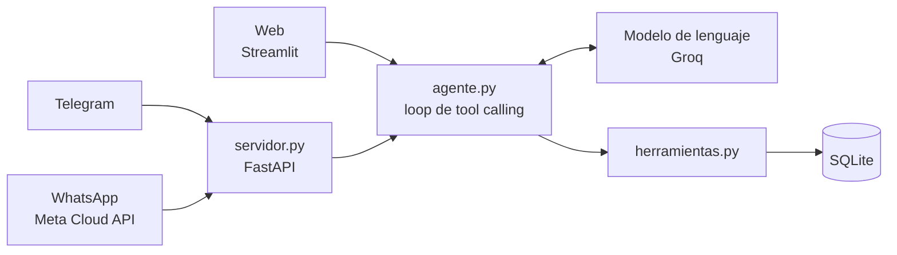

# 💊 Farmacia Chatbot

Asistente virtual de atención al cliente para una farmacia, hecho en Python. Es un **agente de IA con tool calling**: el modelo de lenguaje no responde "de memoria", sino que decide qué herramienta usar (buscar un producto, consultar una cobertura, ver los horarios) y arma la respuesta con los datos reales de la base.

El mismo agente atiende por **tres canales**: una web, Telegram y WhatsApp.

## Probalo

| Canal | Cómo probarlo |
|---|---|
| 🌐 Web | [farmacia-chatbot-mavi.streamlit.app](https://farmacia-chatbot-mavi.streamlit.app) |
| ✈️ Telegram | [t.me/USUARIO_DEL_BOT](https://t.me/USUARIO_DEL_BOT) |
| 💬 WhatsApp | Funciona con la API oficial de Meta, con un número de prueba que solo responde a números autorizados. Se puede ver en el video. |

🎥 **Video de demostración:** LINK_AL_VIDEO

> Los bots de Telegram y WhatsApp corren en un servidor gratuito que se duerme tras 15 minutos sin uso: el primer mensaje puede tardar hasta un minuto en responder.

## Qué sabe hacer

- **Buscar productos** por nombre, marca, principio activo o categoría, e informar precio, si hay stock y si se vende libre o bajo receta.
- **Entender consultas mal escritas**: sin tildes, con errores de tipeo ("amoxicilna") o por categoría ("algo para la tos").
- **Calcular coberturas** de obras sociales y prepagas según el plan, con el porcentaje de descuento y el precio final.
- **Ofrecer alternativas** cuando un producto no tiene stock.
- **Informar sucursales**, horarios, si están abiertas en este momento, medios de pago y servicios.
- **Recordar la conversación**: si el cliente ya dijo su obra social, no se la vuelve a preguntar.

Y lo que **no** hace, a propósito:

- No diagnostica, no recomienda medicamentos para síntomas ni indica dosis: deriva al farmacéutico o al médico.
- No inventa precios ni productos: si no está en la base, lo dice.
- No ofrece reservas, compras ni envíos, porque no puede cumplirlos.
- No informa cantidades de stock, solo si hay o no hay.

## Cómo funciona



1. El cliente escribe por cualquiera de los canales.
2. `agente.py` le manda al modelo la conversación y la lista de herramientas disponibles.
3. El modelo responde pidiendo una herramienta, por ejemplo `consultar_cobertura("losartán", "OSDE", "210")`.
4. El código ejecuta esa función contra la base y le devuelve el resultado al modelo.
5. El modelo puede pedir otra herramienta o redactar la respuesta final. El ciclo tiene un tope de 5 pasos para evitar loops infinitos.

El loop está escrito a mano, sin frameworks de agentes, para entender y controlar cada paso.

### Herramientas del agente

| Herramienta | Qué hace |
|---|---|
| `buscar_producto` | Búsqueda tolerante en el catálogo |
| `consultar_cobertura` | Descuento y precio final según obra social y plan |
| `listar_obras_sociales` | Obras sociales y planes con los que trabaja la farmacia |
| `buscar_alternativas` | Productos con stock de la misma categoría |
| `info_farmacia` | Sucursales, horarios, medios de pago y servicios |

## Tecnologías

- **Python 3.14**
- **Groq** (modelo `openai/gpt-oss-120b`) para el modelo de lenguaje con tool calling
- **SQLite** como base de datos
- **Streamlit** para la interfaz web
- **FastAPI + Uvicorn** para recibir los webhooks de Telegram y WhatsApp
- **pytest** para los tests
- Despliegue en **Streamlit Community Cloud** (web) y **Render** (bots)

## Estructura del proyecto

```
farmacia-chatbot/
├── agente.py          # Prompt, definición de herramientas y loop del agente
├── herramientas.py    # Funciones que consultan la base de datos
├── crear_bd.py        # Crea y carga la base de datos demo
├── app.py             # Interfaz web (Streamlit)
├── servidor.py        # Webhooks de Telegram y WhatsApp (FastAPI)
├── tests/             # 105 tests automáticos
├── render.yaml        # Configuración de despliegue en Render
└── .env.example       # Variables de entorno necesarias
```

## Decisiones de diseño

**El modelo no toca la base de datos.** Solo puede llamar a cinco funciones definidas, que usan consultas parametrizadas. No genera SQL, así que no puede romper ni filtrar nada.

**La búsqueda tolerante está en el código, no en el modelo.** Las consultas se normalizan (minúsculas, sin tildes), se comparan por inicio de palabra y, si no hay coincidencia, se buscan palabras parecidas. Cuando el resultado es aproximado, la herramienta lo marca y el asistente lo aclara: "No encontré 'amoxicilna', pero tengo Amoxicilina 500 mg".

**Las coberturas siguen la lógica real de Argentina.** Solo se cubren medicamentos bajo receta, y el porcentaje depende del tipo: ambulatorio, crónico o de cobertura especial (por ejemplo, diabetes). Los productos de venta libre no tienen cobertura, y la base lo impide con una restricción.

**Un solo agente, varios canales.** Web, Telegram y WhatsApp usan la misma función `responder()`. Cada canal solo se ocupa de recibir y enviar mensajes, así que sumar otro no requiere tocar la lógica.

**Seguridad en los webhooks.** El servidor valida que los mensajes vengan realmente de Telegram y de Meta (token secreto y firma HMAC), descarta mensajes repetidos y limita el historial por conversación. Las claves viven en variables de entorno y nunca se suben al repositorio.

## Datos de demostración

La base es ficticia y se genera con `crear_bd.py`:

- **128 productos** en 6 rubros y 29 categorías: medicamentos, cuidado de la salud, higiene personal, dermocosmética, bebés y maternidad, y perfumería
- **4 obras sociales y prepagas** (OSDE, Swiss Medical, IOSCOR y PAMI) con 12 planes
- **2 sucursales** con horarios por día, medios de pago y servicios

La condición de venta de cada medicamento (venta libre, bajo receta o bajo receta archivada) se verificó contra información pública de ANMAT y prospectos. Los precios, el stock y los porcentajes de cobertura son inventados y solo sirven para la demo.

## Cómo correrlo en tu máquina

Necesitás Python 3.11 o superior y una clave gratuita de [Groq](https://console.groq.com).

```powershell
git clone https://github.com/MaviSandoval/farmacia-chatbot.git
cd farmacia-chatbot

python -m venv venv
venv\Scripts\Activate.ps1          # en Linux o Mac: source venv/bin/activate
pip install -r requirements.txt

copy .env.example .env             # y completá GROQ_API_KEY
```

Para usarlo:

```powershell
streamlit run app.py               # interfaz web
python agente.py                   # chat por consola
uvicorn servidor:app --reload      # servidor de los bots
```

La base de datos ya viene incluida. Para regenerarla: `python crear_bd.py`.

## Tests

```powershell
pip install -r requirements-dev.txt
pytest
```

Son 105 tests que cubren las herramientas, el loop del agente, la interfaz web y los webhooks. No llaman al modelo real ni a servicios externos: usan una base temporal y un cliente falso, así que corren en segundos y sin gastar cuota.

## Limitaciones y próximos pasos

- **WhatsApp usa un número de prueba de Meta**, que solo puede escribirle a números autorizados y no permite personalizar el perfil. El siguiente paso es registrar un número propio y verificar el negocio.
- **Las conversaciones se guardan en memoria** y se pierden cuando el servidor se reinicia. Para producción irían a una base de datos.
- El código también incluye un webhook para **WhatsApp por Twilio**, que quedó implementado y testeado pero sin uso, por las restricciones de la cuenta de prueba.
- Conectar el agente a un sistema de gestión real en lugar de la base demo.

## Privacidad

Ver la [política de privacidad](PRIVACIDAD.md).

## Autora

**María Victoria Sandoval** · Estudiante de Licenciatura en Sistemas de Información (FaCENA-UNNE), Corrientes, Argentina.

[GitHub](https://github.com/MaviSandoval)
